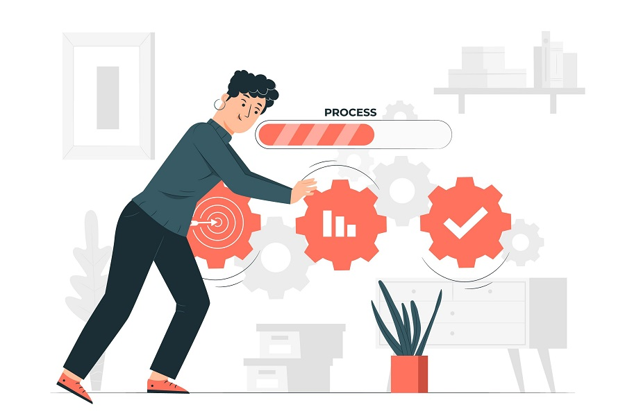

# Cómo Organizarse y Llevar a Cabo un Proyecto en Equipo

Organizarse efectivamente en equipo para llevar a cabo un proyecto requiere de una buena planificación, comunicación y herramientas adecuadas.

## Definición del Proyecto y Objetivos:

Es esencial comenzar con una clara definición del proyecto y establecer objetivos específicos, medibles, alcanzables, relevantes y con un tiempo determinado (SMART). Esto proporciona a todo el equipo una dirección clara y metas concretas a alcanzar.

## Asignación de Roles y Responsabilidades:

Identifica las fortalezas y habilidades de cada miembro del equipo y asígnales roles y responsabilidades que se alineen con sus capacidades. Asegúrate de que cada miembro entienda su rol y cómo contribuye al éxito del proyecto.

## Planificación y Cronograma:

Crea un plan detallado del proyecto que incluya todas las tareas necesarias, los plazos y los hitos importantes. Utiliza herramientas como diagramas de Gantt o software de gestión de proyectos (como Trello, Asana o Microsoft Project) para visualizar el progreso y mantener todo en orden.

## Comunicación Efectiva:

Establece canales de comunicación claros y frecuentes. Esto puede incluir reuniones regulares, actualizaciones por correo electrónico y el uso de herramientas de comunicación instantánea como Slack o Microsoft Teams. La comunicación abierta y constante es clave para resolver problemas rápidamente y mantener a todos alineados.

## Monitoreo y Control:

Realiza un seguimiento continuo del progreso del proyecto para asegurarte de que las tareas se están completando según lo planeado. Utiliza métricas y KPIs (indicadores clave de rendimiento) para evaluar el rendimiento del equipo y hacer ajustes necesarios en tiempo real.

## Evaluación y Retroalimentación:
Al finalizar el proyecto, realiza una evaluación completa para identificar qué salió bien y qué áreas pueden mejorar. La retroalimentación es valiosa para aprender de la experiencia y aplicar esos aprendizajes en futuros proyectos.

    

## Herramientas Recomendadas
Gestión de proyectos: Trello, Asana, Microsoft Project
Comunicación: Slack, Microsoft Teams, Zoom
Colaboración en documentos: Google Workspace, Microsoft 365

---

[volver al inicio](/unidad1)
[Tema siguiente](/unidad1/tema2)

