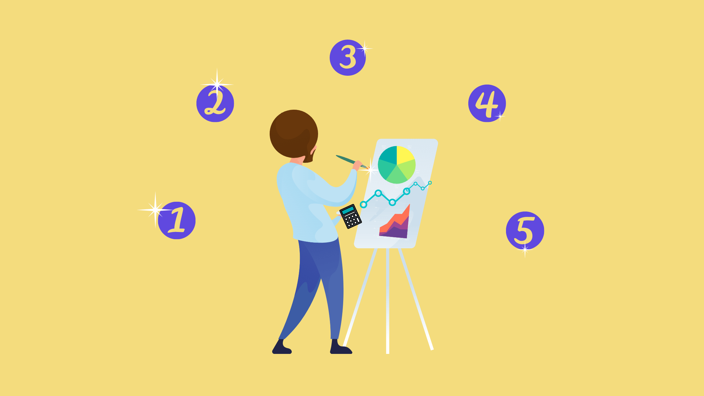

# Metodologias agiles

Las metodologías de trabajo son enfoques estructurados que ayudan a los equipos a organizarse y completar proyectos de manera eficiente. Dos de las metodologías más populares son Scrum y Kanban, ambas utilizadas ampliamente en el desarrollo de software y otros campos para mejorar la productividad y la colaboración.

---

## ¿Qué es Scrum?
Scrum es una metodología ágil que divide un proyecto en ciclos cortos y repetitivos llamados "sprints", que generalmente duran de dos a cuatro semanas. Cada sprint incluye un conjunto específico de tareas que deben completarse. Al inicio de cada sprint, el equipo se reúne para planificar y decidir qué tareas se abordarán. A lo largo del sprint, el equipo se reúne diariamente en reuniones cortas llamadas "stand-ups" para discutir el progreso y cualquier obstáculo. Al finalizar el sprint, se realiza una revisión para evaluar lo que se ha logrado y una retrospectiva para identificar mejoras. Por ejemplo, imagina que un equipo de desarrollo de software trabaja en crear una nueva aplicación móvil. Durante cada sprint, se enfocan en completar funcionalidades específicas como la pantalla de inicio, el registro de usuario o el perfil del usuario.

    

## ¿Qué es Kanban?
Kanban es otra metodología ágil que se centra en visualizar el flujo de trabajo y limitar la cantidad de trabajo en proceso. Utiliza un tablero (físico o digital) dividido en columnas que representan diferentes etapas del proceso, como "Por hacer", "En progreso" y "Hecho". Las tareas se representan como tarjetas que se mueven de una columna a otra a medida que avanzan. El objetivo es mejorar la eficiencia y reducir el tiempo de ciclo, identificando y eliminando cuellos de botella en el proceso. Por ejemplo, en un equipo de diseño gráfico, cada tarea como la creación de un logotipo o el diseño de una página web se coloca en una tarjeta. A medida que los diseñadores trabajan en estas tareas, las tarjetas se mueven de "Por hacer" a "En progreso" y finalmente a "Hecho", permitiendo al equipo ver fácilmente el estado del trabajo y gestionar su carga de manera efectiva.

    

